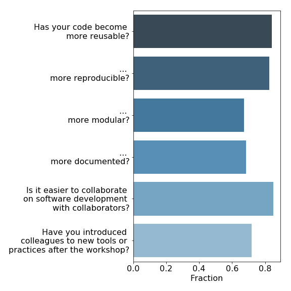

name: inverse
layout: true
class: middle, inverse

---

#### <p align="right"> Albanova, April 2019 </p>

<!---->


#### Thor Wikfeldt (PDC Center for High Performance Computing, Stockholm)


---

layout: false

# About the project

- CodeRefinery is a project within the Nordic e-Infrastructure Collaboration (NeIC). NeIC is an organisational unit under NordForsk.
- Started in September 2016, second phase started Oct 2018
- 3 FTEs spread around the Nordics

### Partners powering CodeRefinery


---

<!-- ## The team -->


<!--


-->

---

# Why CodeRefinery?


---

# The reproducibility crisis


---

# Levels of reproducibility


---

layout: false

# What we do

- Develop lesson material on best practices and tools for sustainable scientific software development
- Deliver workshops around the Nordics
  - 15 regular 3-day workshops, over 500 participants 
  - Interactive, type-along lessons interspersed with exercises


---

# Where do we want to go?

<div style="float: left; width: 50%;">


</div>
<div style="float: right; width: 50%;">
<ul>
<li> Build a network of instructors
<li> 2
<li> 3
<li> 4
</ul>
</div>

---

# What we teach

*All* workshops include:
<div style="float: left; width: 50%;">
<ul>
<li> Version control (Git)
<li> Automated testing 
<li> Code coverage analysis
<li> Modular code development
</ul>
</div>
<div style="float: right; width: 50%;">
<ul>
<li> Jupyter Notebooks
<li> Reproducible research
<li> Documentation
<li> Software licensing
</ul>
</div>

---

## Why version control?

What is the problem with this kind of "version control"?

```shell
mylib-1.2.4_18.3.07.tgz         somecode_CP_10.8.07.tgz
mylib-1.2.4_27.7.07.tgz         somecode_CP_17.5.07.tgz
mylib-1.2.4_29.4.08.tgz         somecode_CP_23.8.07_final.tgz
mylib-1.2.4_6.10.07.tgz         somecode_CP_24.5.07.tgz
mylib-1.2.5_23.4.08.tgz         somecode_CP_25.5.07.tgz
mylib-1.2.5_25.5.07.tgz         somecode_CP_29.5.07.tgz
mylib-1.2.5_6.6.07.tgz          somecode_CP_30.5.07.tgz
mylib-1.2.5_bexc.tgz            somecode_CP_6.10.07.tgz
mylib-1.2.5_d0.tgz              somecode_CP_6.6.07.tgz
mylib-1.3.0_4.4.08.tgz          somecode_CP_8.6.07.tgz
mylib-1.3.1_4.4.08.tgz          somecode_KT.tgz
mylib-1.3.2_22.4.08.tgz         somecode_PI1_2007.tgz
mylib-1.3.2_4.4.08.tgz          somecode_PI_2007.tgz
mylib-1.3.2_5.4.08.tgz          somecode_PI2_2007.tgz
mylib-1.3.3_1.5.08.tgz          somecode_PI_CP_18.3.07.tgz
mylib-1.3.3_20.5.08.tgz         somecode_11.5.08.tgz
mylib-1.3.3_tstrm_27.6.08.tgz   somecode_15.4.08.tgz
mylib-1.3.3_wk_10.8.08.tgz      somecode_17.6.09_unfinished.tgz
mylib-1.3.3_wk_11.8.08.tgz      somecode_19.7.09.tgz
mylib-1.3.3_wk_13.8.08.tgz      somecode-20.7.09.tgz
...
```
---

## Why version control?

### Collaboration

- *"I will just finish my work and then you can start with your changes."*
- *"Can you please send me the latest version?"*
- *"Where is the latest version?"*
- *"Which version are you using?"*
- *"Which version have the authors used in the paper I am trying to reproduce?"*

### Reproduciblity

- How do you indicate which version of your code you have used in your paper?
- *Hmmm, I wonder when this bug got introduced..."*

---

## The essence of version control

- System which records snapshots of a project
- Implements branching:
  - you can work on several feature branches and switch between them
  - different people can work on the same code/project without interfering
  - you can experiment with an idea and discard it if it turns out to be a bad idea
- Implements merging:
  - tool to merge development branches for you


---

## Collaborative version control

<div style="float: left; width: 50%;">

<h4> Forking and derivative projects </h4>


</div>

<div style="float: right; width: 50%;">
<h4> Peer review for code changes </h4>

<ul>
<li> Changes are reviewed and discussed before they are integrated (merged) 
<li> Proposals for non-trivial changes 
<li> Feedback on WIP (work in progress) changes 
<li> Typically coupled with automated testing 
</div>

---

## Testing

<div style="float: left; width: 50%;">

</div>

<div style="float: right; width: 50%;">

<p>
<i>"Before relying on a new experimental device, an experimental scientist always establishes its accuracy. A new detector is calibrated when the scientist observes its responses to known input signals. The results of this calibration are compared against the expected response. An experimental scientist would never conduct an experiment with uncalibrated detectors - that would be unscientific. So too, simulations and analysis with untested software do not constitute science."
</i>
</p>
(copied from Testing and Continuous Integration with Python, created by Kathryn Huff)

</div>

---

## Testing in a nutshell

```python
def fahrenheit_to_celsius(temp_f):
    """
    Converts temperature in Fahrenheit
    to Celsius.
    """
    temp_c = (temp_f - 32.0) * (5.0/9.0)
    return temp_c


def test_fahrenheit_to_celsius():
    temp_c = fahrenheit_to_celsius(temp_f=100.0)
    expected_result = 37.777777
    assert abs(temp_c - expected_result) < 1.0e-6
```

- Tests make sure that expected functionality is preserved
- Tests help users of your code
- Tests help developers of your code
- Tests guide towards modular code structure
> "Program testing can be used to show the presence of bugs, but never to show their absence!" (Edsger W. Dijkstra)

---

## Documentation

Why is project documentation important?
- You will probably use your code in the future and may forget details.
- You may want others to use your code (almost impossible without documentation).
- You may want others to contribute to the code.
- Shield your limited time and let the documentation answer FAQs.

Best practices:
- Division into tutorials, FAQs, and keyword reference
- Documentation should be placed and tracked close to the source code
  - should be versioned together with the code
- Use a standard markup language (RST or Markdown)
- Information for contributors
- Installation instructions

What we teach:
- Host source code with documentation sources on GitHub/GitLab/source.coderefinery.org
- Set up post-receive hook to trigger automatic rebuild of your
  documentation on Read the Docs after each `git push`

---

# Impact

- Results from 3-6 month post-workshop survey




- Encouraging results!

---

## Invitation

CodeRefinery lesson material is open source (CC BY-SA 4.0) and can be used/improved by anyone
  - [coderefinery.org/lessons/](http://coderefinery.org/lessons/)
  - All feedback highly welcome!
  - github.com/coderefinery, @coderefine, support@coderefinery.org
---

# Acknowledgments


<div style="float: left; width: 25%;">

</div>
<div style="float: right; width: 40%;">

</div>
<div style="float: right; width: 30%;">
<br>

</div>

<div>
<ul> 
<li> This presentation was created in cicero (http://cicero.xyz/) 
<li> Slides on https://github.com/wikfeldt/shorttalk-coderefinery 
</ul>
</div>