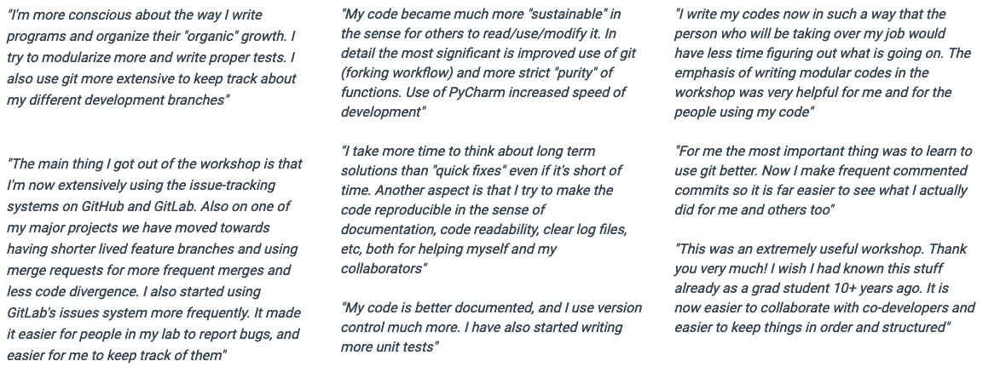

name: inverse
layout: true
class: middle, inverse

---

#### <p align="right"> Albanova, April 2019 </p>

# Training researchers in modern code development tools and reproducible workflows
#### Thor Wikfeldt (PDC Center for High Performance Computing, Stockholm)


---

layout: false

# About the project

- CodeRefinery is a project within the Nordic e-Infrastructure Collaboration (NeIC). NeIC is an organisational unit under NordForsk.
- Started in September 2016, second phase started Oct 2018
- 3 FTEs spread around the Nordics

### Sponsors powering CodeRefinery


---

### Meet the team 


---

# Why CodeRefinery?


---

# Why CodeRefinery?


---

# Why CodeRefinery?


[https://www.nature.com/news/1-500-scientists-lift-the-lid-on-reproducibility-1.1997](https://www.nature.com/news/1-500-scientists-lift-the-lid-on-reproducibility-1.1997)

---

# Levels of reproducibility


---

# Software matters in research

.emph[**Data** is part of research output]

- Funding agencies often ask for a data management plan

.emph[**Software** is part of research output]

- Simulations which generate data
- Control software for instruments
- Post-processing of measurements
- Data processing
- Portals and apps
- Spreadsheets
- Scripts and tools which produce graphs and compute statistics

Curiosity: Not too many projects consider a software management plan **yet**.

Software development should consider .emph[FAIR principles], ideally from the start (https://www.nature.com/articles/sdata201618):
.left-column[
- .emph[**F**indable]
- .emph[**A**ccessible]
]
.right-column[
- .emph[**I**nteroperable]
- .emph[**R**eusable]
]

---

layout: false

# Workshops

.left-column[

]

.right-column[

- ~20 workshops since Dec 2016

- Over 500 participants

- 3-4 instructors per workshop

- We try to recruit local workshop helpers

]

---

# Workshops 

- We teach lesson material on best practices and modern tools for collaborative code development and workflows
- Three-day workshops: interactive teaching with type-along demos and frequent exercises. 


---

# Our participants

Workshop participants range from undergraduate students to full professors, 
and come from a variety of academic disciplines.


---

# What we teach

*All* workshops include:
.left-column[

- [Introduction to version control](https://coderefinery.github.io/git-solo/) 
- [Collaborative version control](https://coderefinery.github.io/git-collaborative/)
- [Automated testing](https://coderefinery.github.io/testing/)
- [Modular code development](http://cicero.xyz/v3/remark/0.14.0/github.com/coderefinery/modular-code-development/master/talk.md)
]
.right-column[
- [Jupyter Notebooks](https://github.com/coderefinery/jupyter)
- [Reproducible research](https://coderefinery.github.io/reproducible-research/)
- [Documentation](https://coderefinery.github.io/documentation/)
- [Social coding](http://cicero.xyz/v3/remark/0.14.0/github.com/coderefinery/social-coding/master/talk.md)
]


*Some* workshops include:

.left-column[
- [Integrated development environments](https://coderefinery.github.io/IDEs/)
- [Git branch design](https://coderefinery.github.io/git-branch-design/)
]

.right-column[
- [Building portable code with CMake](https://coderefinery.github.io/cmake/)
- [Mixed Martial Arts: Interfacing Fortran, C, C++, and Python](https://coderefinery.github.io/mma/)
]

---

## Why version control?

What is the problem with this kind of "version control"?

```shell
mylib-1.2.4_18.3.07.tgz         somecode_CP_10.8.07.tgz
mylib-1.2.4_27.7.07.tgz         somecode_CP_17.5.07.tgz
mylib-1.2.4_29.4.08.tgz         somecode_CP_23.8.07_final.tgz
mylib-1.2.4_6.10.07.tgz         somecode_CP_24.5.07.tgz
mylib-1.2.5_23.4.08.tgz         somecode_CP_25.5.07.tgz
mylib-1.2.5_25.5.07.tgz         somecode_CP_29.5.07.tgz
mylib-1.2.5_6.6.07.tgz          somecode_CP_30.5.07.tgz
mylib-1.2.5_bexc.tgz            somecode_CP_6.10.07.tgz
mylib-1.2.5_d0.tgz              somecode_CP_6.6.07.tgz
mylib-1.3.0_4.4.08.tgz          somecode_CP_8.6.07.tgz
mylib-1.3.1_4.4.08.tgz          somecode_KT.tgz
mylib-1.3.2_22.4.08.tgz         somecode_PI1_2007.tgz
mylib-1.3.2_4.4.08.tgz          somecode_PI_2007.tgz
mylib-1.3.2_5.4.08.tgz          somecode_PI2_2007.tgz
mylib-1.3.3_1.5.08.tgz          somecode_PI_CP_18.3.07.tgz
mylib-1.3.3_20.5.08.tgz         somecode_11.5.08.tgz
mylib-1.3.3_tstrm_27.6.08.tgz   somecode_15.4.08.tgz
mylib-1.3.3_wk_10.8.08.tgz      somecode_17.6.09_unfinished.tgz
mylib-1.3.3_wk_11.8.08.tgz      somecode_19.7.09.tgz
mylib-1.3.3_wk_13.8.08.tgz      somecode-20.7.09.tgz
...
```
---

## Why version control?

### Collaboration

- *"I will just finish my work and then you can start with your changes."*
- *"Can you please send me the latest version?"*
- *"Where is the latest version?"*
- *"Which version are you using?"*
- *"Which version have the authors used in the paper I am trying to reproduce?"*

### Reproduciblity

- How do you indicate which version of your code you have used in your paper?
- "*Hmmm, I wonder when this bug got introduced...*"

---

## The essence of version control

- System which records snapshots of a project
- Implements branching:
  - you can work on several feature branches and switch between them
  - different people can work on the same code/project without interfering
  - you can experiment with an idea and discard it if it turns out to be a bad idea
- Implements merging:
  - tool to merge development branches for you


- We teach the free and open source VCS tool **Git**

---

## Collaborative version control

<div style="float: left; width: 50%;">

<h4> Forking and derivative projects </h4>


</div>

<div style="float: right; width: 50%;">
<h4> Peer review for code changes </h4>

<ul>
<li> Changes are reviewed and discussed before they are integrated (merged) 
<li> Proposals for non-trivial changes 
<li> Feedback on WIP (work in progress) changes 
<li> Typically coupled with automated testing 
</div>

---

## Code repository hosting for Nordic research software

CodeRefinery provides a code repository hosting service that is open and free for 
all researchers based in universities and research institutes from Nordic countries.

> https://source.coderefinery.org/

Based on a GitLab instance, and targets researchers who:

- prefer to keep their code in a private repository until it gets published and prefer the corresponding data to stay in the Nordics and remain under an academic governance
- are careful to not share code or data with a for-profit company (not implying here that the company would use it without asking)
- host their code on local hard drives and look for a better place to host and collaborate but prefer the code to remain private
- run their own GitLab service or other repository hosting server but struggle to keep it up to date and backed up
- need one place to host public and private repositories

---

## Why testing?

<div style="float: left; width: 50%;">

</div>

<div style="float: right; width: 50%;">

<p>
<i>"Before relying on a new experimental device, an experimental scientist always establishes its accuracy. A new detector is calibrated when the scientist observes its responses to known input signals. The results of this calibration are compared against the expected response. An experimental scientist would never conduct an experiment with uncalibrated detectors - that would be unscientific. So too, simulations and analysis with untested software do not constitute science."
</i>
</p>
(copied from Testing and Continuous Integration with Python, created by Kathryn Huff)

</div>

---

## Testing in a nutshell

```python
def fahrenheit_to_celsius(temp_f):
    """
    Converts temperature in Fahrenheit
    to Celsius.
    """
    temp_c = (temp_f - 32.0) * (5.0/9.0)
    return temp_c


def test_fahrenheit_to_celsius():
    temp_c = fahrenheit_to_celsius(temp_f=100.0)
    expected_result = 37.777777
    assert abs(temp_c - expected_result) < 1.0e-6
```

- Tests make sure that expected functionality is preserved
- Tests help users of your code
- Tests help developers of your code
- Tests guide towards modular code structure
> "Program testing can be used to show the presence of bugs, but never to show their absence!" (Edsger W. Dijkstra)

---

## Documentation

Why is project documentation important?
- You will probably use your code in the future and may forget details.
- You may want others to use your code (almost impossible without documentation).
- You may want others to contribute to the code.
- Shield your limited time and let the documentation answer FAQs.

What we teach:
- Writing documentation in markdown or RST
  - Should be easy to write 	   
- Host documentation *along with source code* on GitHub/GitLab/source.coderefinery.org
  - Documentation should be *versioned* in tandem with code
  - One shouldn't need to jump through hoops to write documentation
- Set up git hook to trigger automatic rebuild of your
  documentation on Read the Docs after each `git push`

---

## Jupyter 

A Jupyter Notebook allows the researcher to document 
day-to-day work and interweave results, figures, equations, 
ideas, and hypotheses with code, creating a *computational narrative*.


Why teach Jupyter?
- It is taking over the world (at least within data science: https://www.nature.com/articles/d41586-018-07196-1)
- Reproducibility (e.g., https://github.com/jupyter/jupyter/wiki/A-gallery-of-interesting-Jupyter-Notebooks#reproducible-academic-publications)

---

# Impact

The long-term impact of CodeRefinery workshops is measured through a 
post-workshop survey which is sent out to all former participants 
3-6 months after attending a workshop.


---

# Impact



---

# Where do we want to go?

- CodeRefinery will not be funded indefinitely, will need to reach **sustainability**.
- [The Carpentries](https://carpentries.org/) organization has succeeded:
  - Delivers 100s of workshops per year on foundational coding and data science skills.
  - Taught by volunteer instructors who have completed Carpentry instructor training.

We envision:
- Growing a community of instructors and establishing partnerships with universities and institutions.
- All lesson material to be maintained by the community and volunteers.
- Developing an instructor training program tailored to the CodeRefinery material.
- Travel and accommodation for workshops to be be financed by the hosting institution.

---

# Nordic Research Software Engineers

CodeRefinery is more than just a teaching program – 
it is also about catalysing and building a community of 
Nordic Research Software Engineers (http://nordic-rse.org). 
We aim to:
- Serve as a Nordic hub for research software engineers.
- Connect with thriving RSE communities in the UK, Germany, Netherlands
- Organize a Nordic RSE conference in 2020.
- Organize hackathons, workshops and other events for RSEs.


---

# Invitation

CodeRefinery lesson material is open source and can be freely used/improved:
 - http://coderefinery.org/lessons/
 - All feedback highly welcome!
 - https://github.com/coderefinery

Get in touch through <support@coderefinery.org> to:
- Request a CodeRefinery workshop.
- Sign up as a helper/instructor for CodeRefinery workshops.
- Ask questions about using CodeRefinery material in your own courses.
- Get further information on becoming a CodeRefinery partner.
- Request access to the repository hosting platform source.coderefinery.org.

To get notified of planned workshops in your area: 
- see "Notify me" on https://coderefinery.org/workshops/

We discuss in the open and you can join us on https://coderefinery.zulipchat.com 
- You can listen in, follow certain threads, participate, and influence.


---

# Acknowledgments

- Team members: 
  - Anne Fouilloux, UIO University of Oslo, Norway
  - Bjørn Lindi, NTNU, Trondheim, Norway
  - Juho Lehtonen, CSC-IT center for science, Finland
  - Max R. Eckardt, Datakuben @ University of Southern Denmark
  - Radovan Bast (project manager), UiT The Arctic University of Norway
  - Sabry Razick, UIO University of Oslo, Norway
  - Stefan Negru, CSC- IT center for science, Finland

- This presentation was created in cicero (http://cicero.xyz/) 
- Slides on https://github.com/wikfeldt/longtalk-coderefinery

.left-column[

]
.right-column[

]

---

# Thank you for the attention!


